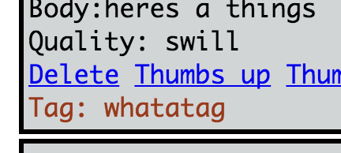

# Ideabox 2.0 Submission Form
[Project Spec](https://github.com/turingschool/curriculum/blob/master/source/projects/revenge_of_idea_box.markdown)

# Basics

### Link to the Github Repository for the Project
[My Repo](https://github.com/thompickett/idea-box)

### Link to the Deployed Application
[My Application](http://idea-boxed.herokuapp.com/)

### Link to My Commits in the Github Repository for the Project
[My Commits](https://github.com/thompickett/idea-box/commits/master)

### Provide a Screenshot of My Application

## Completion

### Were you able to complete the base functionality?
* Yes.

### Which extensions, if any, did you complete?
* I completed the tagging extension
### Attach a .gif, or images of any extensions work being used on the site.

# Code Quality

### Link to a specific block of your code on Github that you are proud of
[Good code](https://github.com/thompickett/idea-box/blob/master/app/assets/javascripts/search_ideas.js#L11-L35)
* I was pretty happy with this code since it showed me having starting to have a decent understanding on JS. I did it without looking it up and just coded it out. I also think it's nice and concise and gets the job done.

### Link to a specific block of your code on Github that you feel not great about
[Bad code](https://github.com/thompickett/idea-box/blob/master/app/assets/javascripts/thumbs_up_or_down.js)
* Not super happy with this code. There's too much duplication. I always meant to get back around to trying to refactor it and never did.
### Attach a screenshot or paste the output from your terminal of the result of your test-suite running.

### Provide a link to an example, if you have one, of a test that covers an 'edge case' or 'unhappy path'

-----

### Please feel free to ask any other questions or make any other statements below!

### EVALUATION

### Data Model

(5 points total.)

### User Flows

#### Viewing ideas

(10 points total.)

#### Adding a new idea

(15 points total.)

#### Deleting an existing idea

(15 points total.)

#### Changing the quality of an idea

(15 points total.)

#### Editing an existing idea

(16 points total.)

* If the user reloads the page, their edits will be reflected. (4 points, mandatory for specification adherence)

#### Idea Filtering and Searching

(15 points total.)

### Extensions

Extensions are a great way to earn additional points beyond the 150 available in this project. That said, awarding points for delivering a given extension is up to the instructor, who may only award partial points depending on the quality of the implementation. The points listed below represent the maximum number of points. Extensions can _not_ be done after the fact without instructor permission in advance.

#### Tagging

(18 additional points.)
- Tags should be a comma-separated list of short text tags

## Instructor Evaluation Points

### Specification Adherence

* **10 points**: The application consists of one page with all of the major functionality being provided by jQuery. There is no use of `format.js` in Rails. There is no use of unobstrusive JavaScript. There are no front-end frameworks used in the application. No approach was taken that is counter to the spirit of the project and its learning goals. There are no features missing from above that make the application feel incomplete or hard to use.

### User Interface

* **5 points** - The application is pleasant, logical, and easy to use. There no holes in functionality and the application stands on it own to be used by the instructor _without_ guidance from the developer.

### Testing

* **0 points** - There is little or no evidence of testing in this application.

### Ruby and Rails Quality

* **8 points** - Developer solves problems with a balance between conciseness and clarity and often extracts logical components. Developer can speak to choices made in the code and knows what every line of code is doing.

### JavaScript Style
* ** 6 points** - Developer knows what code is doing, minor bug with editing an idea is not saved in the database

### Workflow

* **10 points** - The developer effectively uses Git branches and many small, atomic commits that document the evolution of their application.

